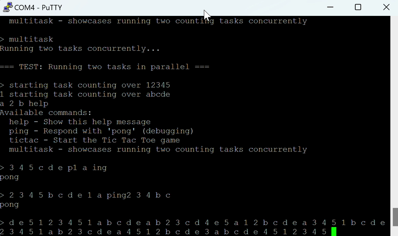
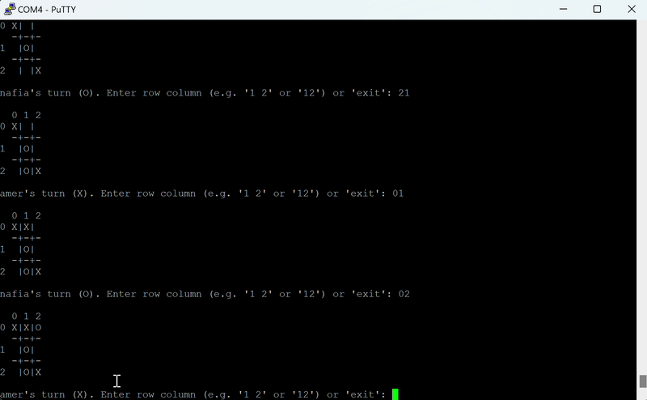

# os-pi

A small bare-metal kernel for the Raspberry Pi 4 written in C and AArch64 assembly. It boots on real hardware and supports primitive preemptively scheduling and an interactive shell over the serial port.

Built for the Operating Systems course (spring 2025) at the University of Basel.

## Demo

Recorded on a Raspberry Pi 4 over the serial console.

| Concurrency | Tic-tac-toe |
|---|---|
| [](docs/media/concurrency.mp4) | [](docs/media/tic-tac.mp4) |

## Features


- **Interrupts:** exception vector table and IRQ handling for the system timer
  and the mini UART.
- **Scheduling:** preemptive scheduler with time slices driven by the system timer.
- **Memory:** physical page allocator with 256 KiB pages.
- **Shell:** `help`, `ping`, `clear`, `tictac` (two-player tic-tac-toe) and
  `multitask` (two counting tasks running concurrently).

## Hardware

- Raspberry Pi 4 Model B and a microSD card
- USB-to-serial adapter with 3.3 V logic

| Adapter | Raspberry Pi |
|---|---|
| RX | GPIO 14 (TXD), pin 8 |
| TX | GPIO 15 (RXD), pin 10 |
| GND | GND, pin 6 |

## Build

```sh
make            # kernel8.img
make debug      # kernel8.img with log output (-DDEBUG)
make armstub    # armstub-el3.bin
make clean
```

## Run

1. Format the SD card as FAT32 and copy the Raspberry Pi firmware boot files
   onto it from [raspberrypi/firmware](https://github.com/raspberrypi/firmware/tree/master/boot).
2. Copy `kernel8.img`, `armstub-el3.bin` and `config.txt` from this repository.
3. Open a serial terminal at 115200 baud and power the Pi.
4. Type `help` at the prompt.


## Acknowledgements

- The structure follows Sergey Matyukevich's
  [raspberry-pi-os](https://github.com/s-matyukevich/raspberry-pi-os) tutorial
  (written for the Raspberry Pi 3).
- The armstub is taken from rockytriton's
  [LLD](https://github.com/rockytriton/LLD/tree/main/rpi_bm) bare-metal series.
- `src/utils/printf.c` is taken from Kustaa Nyholm.
